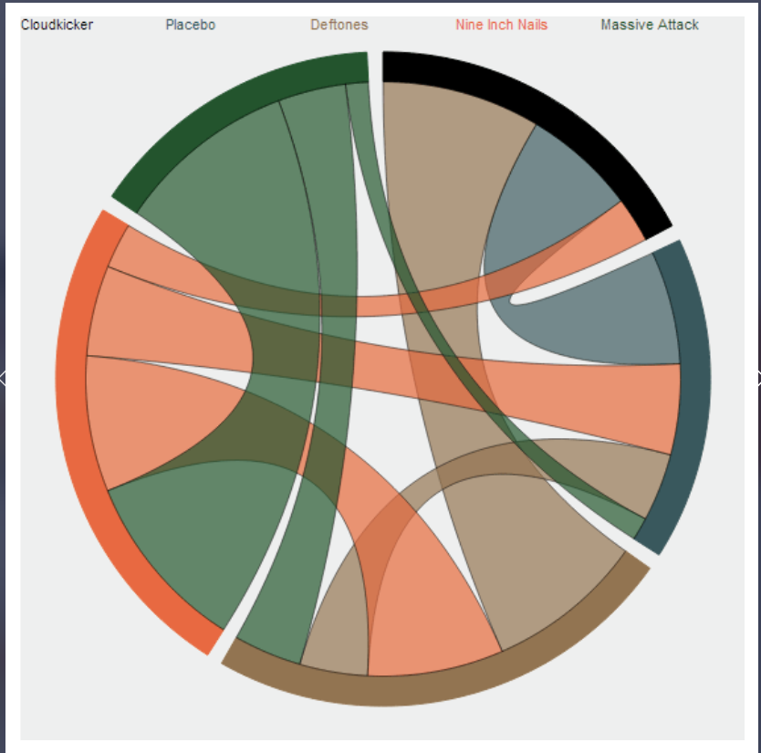
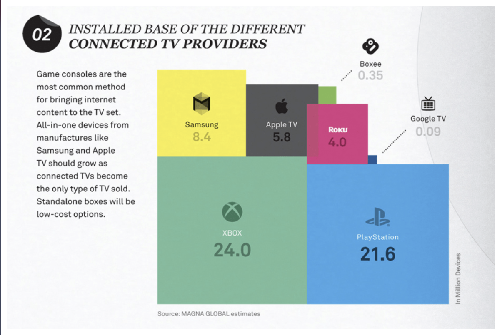

# Data Visualization

## Assignment 2: Good and Bad Data Visualization

### Requirements:

- Data visualizations are important tools for communication and convincing; we need to be able to evaluate the ways that data are presented in visual form to be critical consumers of information 
- To test your evaluation skills, locate two public data visualizations online, one good and one bad  
    - You can find data visualizations at https://public.tableau.com/app/discover or https://datavizproject.com/, or anywhere else you like! 
    bad example:https://datavizproject.com/data-type/chord-diagram/ 
    
    good example: https://datavizproject.com/data-type/proportional-area-chart/
    
- For each visualization (good and bad):  
    - Explain (with reference to material covered up to date, along with readings and other scholarly sources, as needed) why you classified that visualization the way you did.
      ```
      Comments about the bad example
    Three most important reasons that making that visualization bad: 
    1. Difficult to understand. Not perceptually clear. 
    2. Not accesible by everyone. People with color blindness could have difficulty telling apart tomato and green colors. 
    3. Audience cannot navigate easily in the visual. 
    4. Difficult to see the text. Larger fontsizes needed.
    The bad figure is complicated, visually diffucult to understand and not color blind friendly. It is difficult to understand what the figure is about. There is no description presented for the connections between different groups. It is not clear what are those groups. A non-familiar person would have difficulty understanding the groups are the music bands. It is not clear if the relative sizes of the groups are clear. It is also difficult to read the text. 


      Comments about the good example
    1. Closure. The units/groups in the visual is closed. 
    2. Perceptually clear. 
    3. Good cognitive load. 
    4. Accesible. Color blind friendly. 
    The good example posses many good features that we discussed in the class. It follows Gestalt principles. The groups in the visual are clearly seperated from each other. It is easy to distinguish the boundaries of different groups in the visual. It is easy to interpret the information available in the figure. The cognitive load is well balanced. It is not overwhelming. There is an additional text explaining what the figure is about. It is accesible by the larger society. People suffering from color blindness could understand that visual by reading the text in the boxes in the worst case. Also black and white version of the visual is also understandable because of the texts available in the boxes. 

      ```
    - How could this data visualization have been improved?  
      ```
    Visualizations are an effective way to communicate information and results to an audience. It is true however if they are easy to interpret. In its current form this figure is not clear. It is unclear what the relative sizes of the music groups represent. If, for example, the sizes correspond to how frequently each group is listened to an alternative visualization—such as a bubble plot could be helpful. The bubble size encodes listening frequency would convey this information more explicitly. In addition, the connections between music groups are difficult to interpret. A relational visualization, such as a heatmap, would more clearly represent the pairwise relationships between different music bands under the chosen metric.

    The other problem in the figure is the lack of accesibility. This can be improved easily. With the better color selection, this figure could be more accesible to color blind people. There are color palettes available in the matplotlib module. Furthermore, the figure can benefit from making font size of the text bigger. It is difficult to see with this size. Also colors selected makes some of the texts hard to see. 


      
      ```
- Word count should not exceed (as a maximum) 500 words for each visualization (i.e. 
300 words for your good example and 500 for your bad example)

### Why am I doing this assignment?:

- This assignment ensures active participation in the course, and assesses the learning outcomes
* Apply general design principles to create accessible and equitable data visualizations
* Use data visualization to tell a story

### Rubric:

| Component               | Scoring   | Requirement                                                 |
|-------------------------|-----------|-------------------------------------------------------------|
| Data viz classification and justification | Complete/Incomplete | - Data viz are clearly classified as good or bad<br />- At least three reasons for each classification are provided<br />- Reasoning is supported by course content or scholarly sources |
| Suggested improvements  | Complete/Incomplete | - At least two suggestions for improvement<br />- Suggestions are supported by course content or scholarly sources |

## Submission Information

🚨 **Please review our [Assignment Submission Guide](https://github.com/UofT-DSI/onboarding/blob/main/onboarding_documents/submissions.md)** 🚨 for detailed instructions on how to format, branch, and submit your work. Following these guidelines is crucial for your submissions to be evaluated correctly.

### Submission Parameters:
* Submission Due Date: `23:59 - 10/26/2025`
* The branch name for your repo should be: `assignment-2`
* What to submit for this assignment:
    * This markdown file (assignment_2.md) should be populated and should be the only change in your pull request.
* What the pull request link should look like for this assignment: `https://github.com/<your_github_username>/visualization/pull/<pr_id>`
    * Open a private window in your browser. Copy and paste the link to your pull request into the address bar. Make sure you can see your pull request properly. This helps the technical facilitator and learning support staff review your submission easily.

Checklist:
- [ ] Create a branch called `assignment-2`.
- [ ] Ensure that the repository is public.
- [ ] Review [the PR description guidelines](https://github.com/UofT-DSI/onboarding/blob/main/onboarding_documents/submissions.md#guidelines-for-pull-request-descriptions) and adhere to them.
- [ ] Verify that the link is accessible in a private browser window.

If you encounter any difficulties or have questions, please don't hesitate to reach out to our team via our Slack. Our Technical Facilitators and Learning Support staff are here to help you navigate any challenges.
